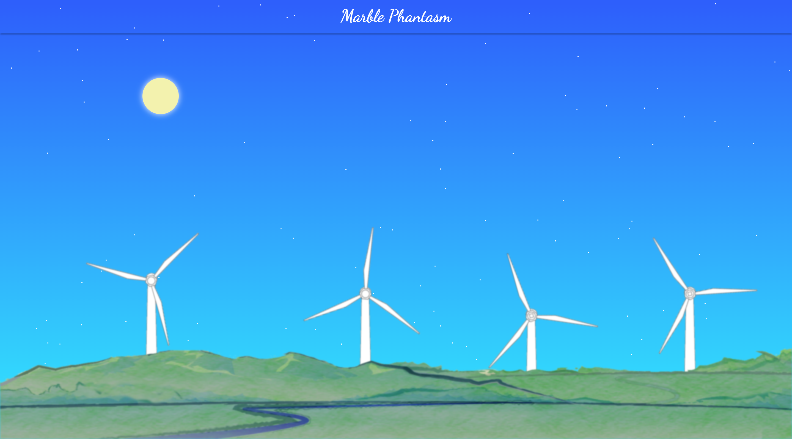

# README.md

## いい感じのブログ作った



和歌山な感じで叙情的で優しい感じのホームページを作りたった

元ネタは2013年に自作したホームページ

失われたコードを書き直した感じ

## 使い方

主にDocker化してるので

```
docker-compose up --build -d
docker-compose exec app rails db:migrate
```

で動く


## これから
管理ツールを導入したのでブログとかのコンテンツ管理はそっちでやる

APIサーバーもAngular2とAPIとで役割を分けたい

## やること

* ~[ ] Angular2の導入~

* [x] https化する(Docker containerでね)

* [ ] ブログやろうぜブログ！

* ~[ ] いいからAngularだ！~
